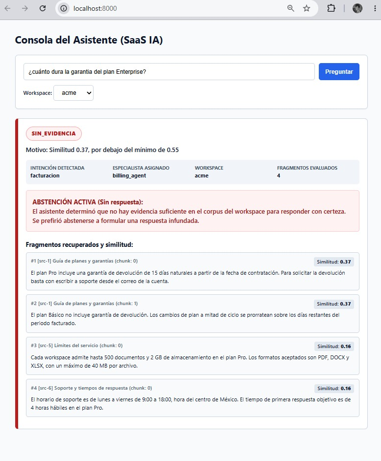

# Notas de entrega Jesus David Ruiz Garcia

## Resumen
- Ejercicio 1 (Clasificador de intención): Completado y pasando los 18 tests originales con normalización NFKD sin duplicar lógica.
- Ejercicio 2 (Reporte de cobertura): Completado con asincronía real, reutilización estricta de singletons y 5 tests adicionales con nombres semánticos.
- Ejercicio 6 (La consola del asistente): Pipeline `consultar()` desacoplado del servidor HTTP, interfaz nativa con códigos de color para diferenciar sustento y abstención activa, y suite de 5 tests pasando.
- Ejercicio 3 (Code review de código real): 7 defectos identificados con síntomas de producción, código corregido resolviendo el problema N+1 y test de regresión pasando.
- Ejercicio 4 (Prompt del Verificador): Prompt v2 estructurado en JSON con criterio anti-citas genéricas, veredicto DUDOSO justificado, umbral de similitud calibrado y auditoría de los 5 casos detectando la trampa en `a-4`.
- Ejercicio 5 (Guardia anti-loop): Implementación `LoopGuard` thread-safe con `threading.RLock()`, mensajes accionables para incidentes y suite de 7 tests unitarios.

## Tiempo
- Hora de inicio: 10:35 p.m. // 07 - Septiembre - 2026
- Hora de entrega: 12:30 a.m. // 08 - Septiembre - 2026
- Horas por ejercicio:
    - Ejercicio 1: ~35 min
    - Ejercicio 2: ~30 min
    - Ejercicio 6: ~45 min
    - Ejercicio 3: ~35 min
    - Ejercicio 4: ~25 min
    - Ejercicio 5: ~20 min

## Decisiones
### Decisiones de las que estoy más seguro
1. **Propagar `KeyError` ante un workspace inexistente (Ejercicio 2):** Se decidió conscientemente no devolver un diccionario vacío `{}` ni conteos en `0`. Un workspace inexistente es un error semántico/404 de la petición o configuración. Silenciarlo devolvería una métrica falsa a producto, sugiriendo que el cliente tiene un workspace configurado pero sin mensajes.
2. **Abstención activa estricta en el pipeline (Ejercicio 6):** Forzar `respuesta: None` cuando el puntaje de similitud queda por debajo de `UMBRAL_MINIMO` o no hay fragmentos. Es el mecanismo fundamental para evitar alucinaciones en producción: el asistente prefiere callarse antes que entregar información sin sustento.
3. **Threading Lock en `LoopGuard` (Ejercicio 5):** Aunque el event loop de asyncio en Python es cooperativo de un solo hilo, las llamadas de red a LLMs o tools sincrónicas suelen descargarse a `asyncio.to_thread` o pools de hilos. Incorporar un `threading.RLock()` previene race conditions en el conteo de llamadas sin penalizar el rendimiento.

### Decisiones de las que estoy menos seguro
1. **Umbrales estáticos fijos de similitud (0.55 y 0.75 en Ejercicio 6):** Los puntajes léxicos basados en IDF y solapamiento varían drásticamente según la longitud de la pregunta del usuario. Una pregunta muy concisa puede generar un puntaje artificialmente bajo a pesar de ser relevante. En producción requeriría umbrales dinámicos calibrados contra un dataset de evaluación o un re-ranker.
2. **Eliminar completamente la escritura en `/tmp` en vez de aislarla por proceso/workspace (Ejercicio 3):** Se decidió suprimir `Path("/tmp/last_answers.json").write_text()` porque en un servicio cloud sin estado genera colisiones de concurrencia y no aporta al contrato de retorno de la función. Si algún componente externo de observabilidad dependía estrictamente de ese archivo, requeriría un dump estructurado mediante logs o un storage temporal por request ID.

## Ejercicio 1 - reglas vs LLM
Una ventaja clave de las reglas es el determinismo estricto, la latencia despreciable (<1 ms) y el costo operativo cero sin riesgo de alucinaciones sintácticas. Su desventaja principal es la fragilidad semántica ante variaciones léxicas, faltas ortográficas complejas, ambigüedad contextual o intenciones implícitas no mapeadas. Cambiaría a un clasificador entrenado (como un encoder ligero tipo SetFit o un LLM pequeño destilado) cuando el catálogo de intenciones crezca más allá de 30 categorías o cuando la tasa de mensajes caídos en "desconocido" crezca en producción debido a que los usuarios formulan preguntas de forma conversacional, indirecta o con lenguaje coloquial variado.

## Ejercicio 3 - tabla de defectos

| # | Línea | Qué está mal | Gravedad | Síntoma que produce en producción |
|---|---|---|---|---|
| 1 | 14 | Argumento mutable como valor por defecto (`cache={}`). | Crítica | El diccionario persiste durante todo el ciclo de vida del proceso de Python. Si un usuario A consulta un workspace con `min_similitud=0.85`, el resultado filtrado se cachea; cuando un usuario B consulta el mismo workspace pidiendo todas las respuestas (`min_similitud=0.0`), recibe la respuesta incompleta del usuario A. |
| 2 | 18 | Instanciación directa de cliente (`db = DatabaseClient()`) en lugar del singleton. | Alta | Se crea una nueva conexión/instancia por cada invocación. En producción contra una base de datos real, provoca agotamiento del connection pool (too many connections) y degrada la latencia bajo concurrencia. |
| 3 | 24 | Consulta síncrona en bucle iterativo (problema $N+1$). | Media-Alta | Para $N$ respuestas se lanzan $N$ llamadas secuenciales independientes a la tabla `sources`, incrementando linealmente la latencia total de la petición de forma innecesaria. |
| 4 | 23-25 | Falta de validación ante fuentes inexistentes (`source.to_dict()["titulo"]`). | Alta | Si un registro en `answers` apunta a un `source_id` huérfano o eliminado, `source.to_dict()` devuelve `{}` y el acceso a `["titulo"]` lanza `KeyError`, abortando la petición completa con error 500. |
| 5 | 26 | Asignación de confianza con evaluación booleana estricta sin validar tipado. | Media | Si `similitud` no está presente o es nulo, la comparación lanza `TypeError`. Además, reduce a clasificación binaria sin contemplar umbrales intermedios. |
| 6 | 27 | Filtrado tardío (`if data["similitud"] >= min_similitud`) tras consultar la base. | Media | Se consumen llamadas de red y recursos de la base de datos para recuperar títulos de fuentes de registros que terminan descartándose inmediatamente después. |
| 7 | 30 | Efecto secundario de I/O en disco global rígido (`/tmp/last_answers.json`). | Crítica | En una arquitectura sin estado (stateless/contenedores), el almacenamiento local no es compartido ni persistente. Bajo concurrencia, peticiones paralelas colisionan sobre el mismo archivo generando race conditions y lecturas inconsistentes entre usuarios. |

## Ejercicio 4 - qué movería a código determinista
Movería a código determinista (Python) la validación de integridad de metadatos y trazabilidad: verificar mediante un set lookup en memoria que `source_id` exista en la tabla `sources`, comprobar que `chunk` sea un entero no nulo, que `similitud >= 0.70`, y que la cadena `cita` sea una subsecuencia exacta (`in` normalizado) dentro del texto original del documento. Un LLM es probabilístico y puede pasar por alto referencias forjadas o fragmentos nulos por atender únicamente a la coherencia semántica. Dejar las reglas booleanas y de existencia en código garantiza 100% de confiabilidad sin latencia, reservando el LLM únicamente para evaluar si la respuesta sintetizada no contradice o tergiverse la cita literal.

## Ejercicio 5 - dónde enchufo la guardia
Enchufaría la guardia en el despachador central de ejecución de herramientas (el orquestador/tool-calling loop del agente), justo en la capa intermedia antes de invocar cualquier herramienta (`before_tool_execution` hook o decorador en el `ToolExecutor`). Ubicarla en este punto único centralizado garantiza que ningún agente ni especialista pueda eludir el control, independientemente de qué herramienta invoque, cómo la configure o si un desarrollador agrega una herramienta nueva en el futuro. Poner la guardia dentro de cada herramienta individual violaría el principio DRY, multiplicaría puntos de fallo por omisión humana y fallaría al detectar loops alternados donde el agente cicla llamadas entre dos herramientas distintas (A -> B -> A -> B) consumiendo tokens y presupuesto sin que ninguna herramienta alcance su cuota individual de forma aislada.

## Ejercicio 6 - cómo mejoraría el recuperador
El recuperador léxico actual falla con sinónimos ("restablecer contraseña" vs "recuperar acceso") porque indexa y pondera términos exactos mediante stems de 5 caracteres. Para resolverlo, implementaría una arquitectura híbrida: embeddings densos multilingües (como text-embedding-3-small o BAAI/bge-m3) combinados con BM25 mediante Reciprocal Rank Fusion (RRF). El vector captura proximidad semántica e intenciones equivalentes, mientras que BM25 preserva precisión en códigos o nombres de planes. El costo asociado implica latencia extra durante la ingestión (cálculo de embeddings asíncrono), consumo de memoria RAM o costo de base de datos vectorial (ej. pgvector/Qdrant) y costo monetario por token al generar representaciones vectoriales.

## Captura de Consola (Plan Enterprise)

## Uso de IA
- En general se está utilizando IA para ayuda a la redacción y análisis de casos borde.
- Ejercicio 1: Se utilizó Gemini para validar las reglas de normalización NFKD y el criterio del patrón más largo.
- Ejercicio 2: Se utilizó Gemini para estructurar la asincronía, los casos borde en `tests/test_intent_report.py` y la consulta a la base de datos respetando singletons.
- Ejercicio 6: Se utilizó Gemini para desacoplar `consultar()` del servidor HTTP, depurar la llamada a `search()`, implementar los estilos de la interfaz web nativa y redactar los tests de abstención y casos dudosos.
- Ejercicio 3: Se utilizó Gemini para analizar antipatrones en el código heredado, redactar los síntomas de producción de la tabla y diseñar el test de regresión del mutable por defecto.
- Ejercicio 4: Se utilizó Gemini para la formulación del prompt v2 en formato JSON, la justificación de negocio del veredicto DUDOSO y la detección de la trampa en los casos de prueba.
- Ejercicio 5: Se utilizó Gemini para diseñar la clase `LoopGuard` con locks reentrantes de concurrencia y la batería de tests unitarios independientes.

## Qué haría con una semana más
1. **Pipeline de evaluación sintética (RAG Evals):** Implementaría un framework determinista (como Ragas o DeepEval) para evaluar fidelidad factual (faithfulness), relevancia contextual y respuesta en un dataset sintético etiquetado de preguntas frecuentes.
2. **Re-ranking semántico:** Incorporaría un modelo de cross-encoder (ej. `bge-reranker-large`) después de la recuperación léxica para refinar el orden de los fragmentos antes de enviarlos al verificador, evitando falsos positivos por coincidencia de palabras superficiales.
3. **Persistencia distribuida para la guardia:** Migraría el almacenamiento en memoria de `LoopGuard` a una base en memoria compartida (Redis) con TTL automático por sesión, permitiendo límites globales en entornos donde los agentes escalan horizontalmente en múltiples contenedores o pods de Kubernetes.
4. **Streaming en la consola:** Implementaría Server-Sent Events (SSE) en `app.py` para visualizar en vivo el progreso paso a paso de cada etapa del pipeline (clasificación -> búsqueda -> veredicto) reduciendo la percepción de latencia para el usuario final.